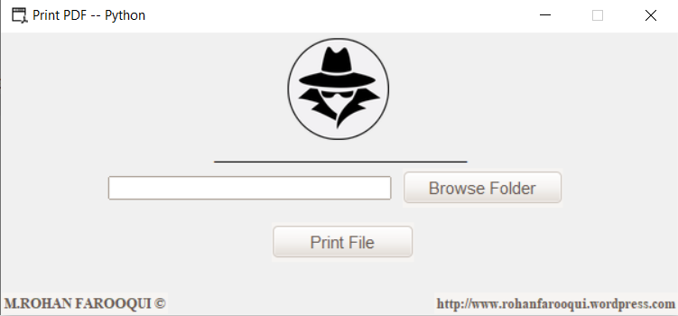

# Print PDF Python



A simple, user-friendly desktop application built with Python and Tkinter to seamlessly select and print PDF files. The application leverages Ghostscript under the hood to handle the PDF printing process directly to your system's default printer.

## 🌟 Features
- **Intuitive GUI**: Clean and simple graphical interface created with Tkinter and themed with `ttkthemes`.
- **Easy File Selection**: Browse and select any PDF file from your system.
- **One-Click Printing**: Send your selected PDF directly to the default printer without opening any external PDF viewer.
- **Standalone Executable**: Easily build the app into a `.exe` file for Windows users.

## 🔗 Links
- **Blog Post**: [Read more about the project here](https://rohanfarooqui.wordpress.com/2020/05/18/print-pdf-python/)
- **Demo Video**: [Watch it in action on YouTube](https://www.youtube.com/watch?v=E38F5p-ZjLM)

## 🛠️ Prerequisites

To run the script from the source, ensure you have **Python 3** installed along with the following dependencies. You can install them via `pip`:

```bash
# GUI Themes
pip install ttkthemes

# Windows API for printing
pip install pywin32

# Required for building the .exe file
pip install cx_Freeze==6.1
```
*(Note: Tkinter and os are generally included by default with standard Python installations.)*

## 🚀 How to Run

1. Clone or download the repository to your local machine.
2. Navigate to the script directory (`Print Pdf Py - Script - 1.0`).
3. Run the main Python script:
   ```bash
   python "Print Pdf Python.pyw"
   ```
4. Click **Browse Folder** to select a PDF file.
5. Click **Print File** to send it to your default printer.

## 📦 Building the Executable

If you wish to create a standalone Windows executable (`.exe`), you can use the provided `setup.py` script using cx_Freeze:

```bash
python setup.py build
```
This will generate a `build` folder containing your executable application that can run on systems without Python installed.
